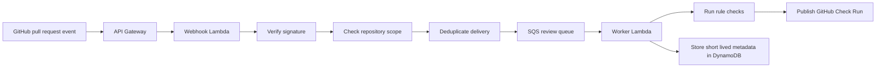

## Two line description

PRPilot is a self-hosted GitHub App that checks pull requests before a human reviewer spends time on them.  
It focuses on privacy, clear GitHub feedback, and low-cost rule-based reviews without using AI for required decisions.

## Longer description

PRPilot is a developer tool for teams or individual developers who want fast pull request feedback inside GitHub. The app receives pull request events, verifies that the event is real, checks that the repository is allowed, avoids duplicate work, queues the review, runs deterministic checks, and publishes the result back as a GitHub Check Run.

The main review path is called the fast lane. It is designed to be the required check that runs during the normal pull request flow. It looks at changed files, workflow files, package files, lockfile changes, and risky patterns. If it can review the pull request honestly, it reports success, warning, or failure. If it cannot complete a full review, it reports that clearly instead of pretending everything passed.

The project is built around a self-hosted model. The deployment owner runs the GitHub App in their own AWS account and controls the selected repositories, runtime policy, logs, storage, and cost limits. This makes the project suitable for private repositories where code should not be sent to third-party AI services.

The backend is built with TypeScript, Node.js, AWS Lambda, API Gateway, SQS, DynamoDB, Parameter Store, Octokit, Zod, and Vitest. API Gateway and a Lambda function handle GitHub webhooks. SQS separates webhook delivery from slower review work. A worker Lambda runs the review logic. DynamoDB stores delivery state, run summaries, attempt records, counters, and short-lived metadata. Parameter Store keeps secrets and runtime policy outside the code.

The project also includes careful guardrails. Webhook signatures are verified before side effects. Deliveries are deduplicated. Queue handoff must succeed before GitHub gets a successful response. New commits supersede older queued jobs. Required checks stay deterministic and explainable. Optional deep scans can exist later, but they do not change the required fast-lane result.

## Core flow

## What I built

- GitHub webhook security foundation
- Signature verification for incoming GitHub events
- Selected repository scope checks
- Normalized webhook payload handling
- Delivery deduplication before queue handoff
- Safe async handoff using SQS
- Fast-lane review design for required pull request checks
- Runtime policy design through Parameter Store
- Short retention persistence design with DynamoDB
- GitHub Check Run output model with clear operational failures

## Why this project matters

PRPilot shows that pull request automation does not need to be a large hosted platform. The main value is a small, private, predictable review path that gives developers feedback before a human reviewer starts. It also shows cloud architecture decisions that are practical for a student or solo developer, such as queue-based processing, short-lived data, clear failure states, and strict cost limits.