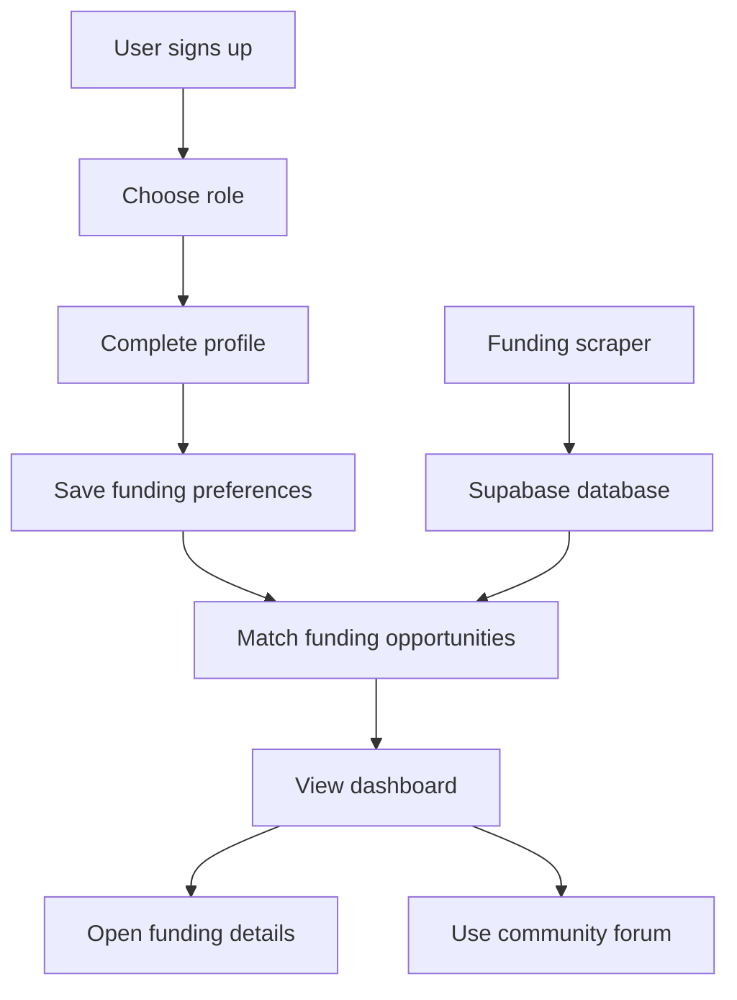

## Two line description

Auctus helps people find Canadian funding opportunities that match who they are and what they need.  
It supports businesses, students, and professors through role-specific pages, saved preferences, recommendations, and a community forum.

## Longer description

Auctus is a funding discovery platform built for Canadian users who need a clearer way to find grants, scholarships, bursaries, and research funding. The project was built as a team platform and taken to Fredericton Ideation Boost Camp in January 2026.

The app supports three main account types. Businesses can look for grants and support programs. Students can look for scholarships and bursaries. Professors can look for research funding. Each role gets pages and filters that match its funding needs instead of forcing everyone through one generic search flow.

The platform includes Supabase authentication, profile onboarding, saved funding preferences, profile-based match scoring, funding detail pages, official application links, and a dashboard. The dashboard shows recommended funding, upcoming deadlines, profile details, and forum activity.

Auctus also includes a community forum where users can create threads, reply to discussions, and vote on helpful answers. This makes the platform more than a list of funding links. It gives users a place to ask questions, share context, and learn from others with similar funding goals.

The project also has a scraper package for ingesting official Canadian funding sources. The scraper is meant to help keep the platform populated with real funding opportunities instead of relying only on manually entered records.

The database is managed through Supabase migrations. The schema includes base profiles, role-specific profile tables, funding records, funding preferences, scrape metadata, forum threads, replies, helpful votes, row-level security rules, public funding read policies, and tag backfills for better matching.

## Core flow

## What I built

- Role-specific funding pages
- Supabase authentication
- Profile onboarding
- Saved funding preferences
- Match scoring based on profile information
- Funding detail pages with official application links
- Dashboard for recommended funding and deadlines
- Community forum with threads, replies, and helpful votes
- Scraper package for official funding source ingestion
- Supabase migrations and row-level security planning

## Why this project matters

Funding information is often scattered across many websites. Auctus brings the discovery process into one place and makes it easier to start from the user’s role and needs. The project also shows practical full-stack work, including authentication, database design, protected data access, matching logic, forum features, and automated data ingestion.