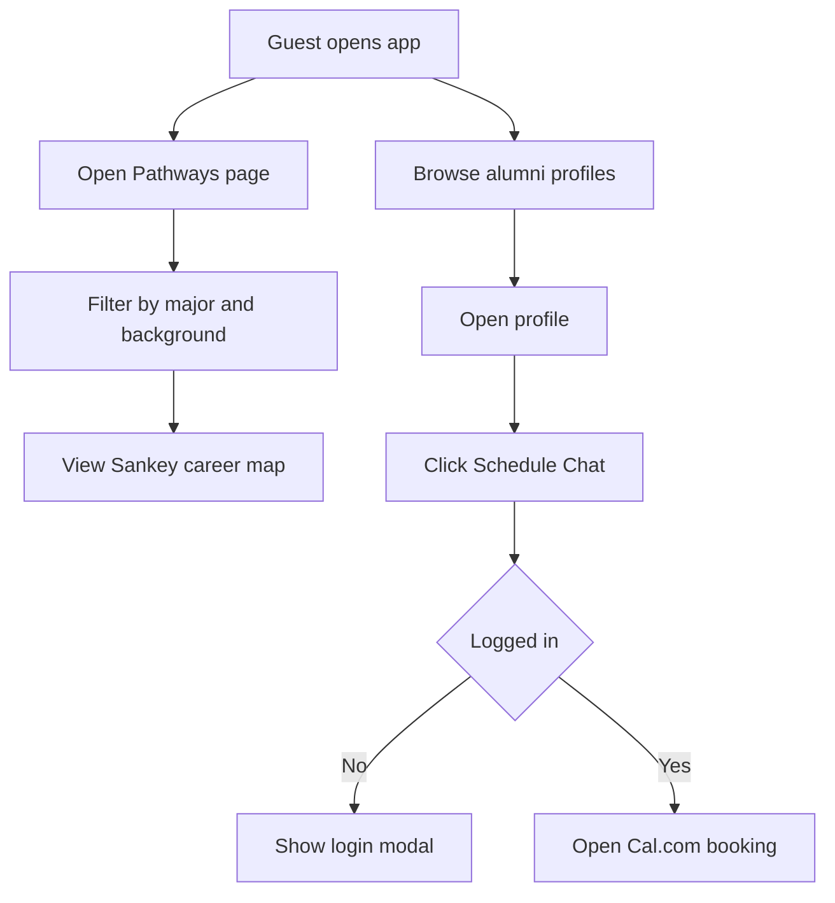
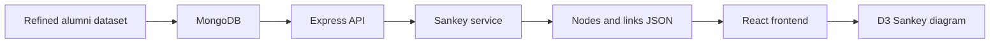

## Two line description

D3Careers helps students explore real career movement through a visual career map.  
Students can filter paths, read alumni profiles, and use the app as a starting point for mentor chats.

## Links

[Live site](https://d3-careers.vercel.app/)

## Longer description

D3Careers is a full-stack career exploration app built to help students understand how people move from majors into first jobs and later roles. The main page uses a D3 Sankey diagram to show career movement in a visual way. A student can open the app, filter by major and background, browse alumni profiles, and try to schedule a chat with someone who followed a similar path.

The public pages are designed to work without login. Guests can open the career pathway page, use the Sankey diagram, browse alumni cards, and view alumni profile pages. Login is only needed when a user wants to access protected features such as dashboards, profile completion, or booking-related actions.

The app uses React and Vite on the frontend, Node.js and Express on the backend, MongoDB for stored data, JWT for authentication, and Cal.com for scheduling. Cal.com handles the meeting booking flow so the project can focus on career exploration instead of building a full scheduling system from scratch.

The alumni data started from a real Kaggle careers dataset that was cleaned and reshaped for this app. The dataset was refined into more believable career paths, weighted by major, and enriched with background tags like first generation, transfer, and international. That data powers the alumni pages, alumni profiles, and Sankey diagram.

The backend builds the Sankey data from alumni career timelines. Each alumni record has a career timeline. The backend turns those timelines into nodes and links, then the frontend renders the diagram with D3. The app also includes protected routes, role-based flows, password hashing, rate limiting, input validation, CORS setup, and ID checks so users cannot access someone else’s protected data by changing a URL.

Testing was added around important backend behavior. The current test areas include Sankey shape building, Sankey route behavior, and booking signature helper logic.

## Core flow

## Data flow

## What I built

- Public career pathway page
- D3 Sankey diagram for career movement
- Filters for major, background, and path depth
- Alumni list and alumni profile pages
- Student and alumni registration
- JWT login and protected routes
- Alumni dashboard for profile completion
- MongoDB models for users and alumni data
- Cal.com booking integration
- Backend webhook route for booking events
- Tests for Sankey data shape, routes, and booking helpers

## Why this project matters

Career advice can feel vague when students only hear job titles without seeing the path between them. D3Careers turns those paths into a visual map. It also shows full-stack application work with real data shaping, authentication, protected dashboards, API design, data visualization, and scheduling integration.
