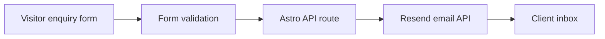

## Two line description

BSI Solutionz is a public business website for a hoist, crane, generator, and material handling dealer.  
The site helps visitors understand products, explore services, and send enquiries through a simple validated form.

## Links

[Live site](https://www.bsisolutionz.com/)

## Longer description

BSI Solutionz is a client website project for a business that sells and supports industrial material handling products. The website presents the company, its product categories, service support, and enquiry options in a clean public-facing format.

The main goal was simple. Visitors should be able to understand what BSI Solutionz offers and send an enquiry without friction. The site focuses on product discovery, clear enquiry capture, fast loading pages, and easy hosting.

Astro was used for the main site because most pages are content focused. This keeps the website fast and avoids sending a full app to the browser when the page only needs static content. React is used only where interaction is needed, mainly for enquiry-related UI. Tailwind CSS is used for styling so layout and design changes stay simple.

The enquiry flow uses Zod and React Hook Form for validation. This helps catch missing or invalid information before anything is sent. When a visitor submits the form, the request goes to an Astro API route. The API route validates and cleans the input, then sends the enquiry email through Resend. The email provider secrets stay on the server side and are never exposed to the visitor.

A separate backend was considered during planning, but it was not needed for the current version. The client mainly needed reliable email delivery, not a full stored lead database. Avoiding a separate backend also keeps the site easier to maintain and avoids slow cold starts on free backend hosting.

The site was also reviewed with Lighthouse. The recorded scores were strong for accessibility, best practices, and SEO on both desktop and mobile.

## Enquiry flow

## What I built

- Public business website
- Product and service presentation pages
- Enquiry form experience
- Form validation using Zod and React Hook Form
- Server-side enquiry route
- Resend email delivery integration
- Fast Astro-based page structure
- React used only for interactive pieces
- Tailwind CSS layout and styling
- Lighthouse review for performance and quality checks

## Why this project matters

This project shows client-focused web development. The goal was not to overbuild a complex system. The goal was to make a fast, clear, reliable website that solves the business need. It also shows practical decision making around when not to use a separate backend, when to keep a site mostly static, and how to protect email secrets while still supporting form submissions.
