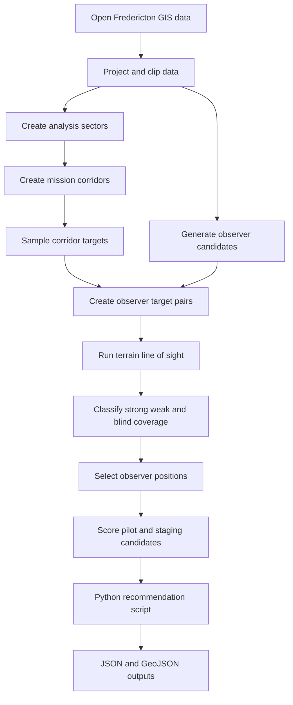

## Two line description

EVLOS-OPS is a GIS project that maps possible drone pilot staging points and visual observer positions in Fredericton.  
It uses terrain visibility, coverage gaps, scoring rules, and Python exports to support planning decisions.

## Links

[ArcGIS output](https://arcg.is/1vWLuH2)

## Longer description

EVLOS-OPS is an educational GIS decision-support prototype for EVLOS-style drone corridor planning in Fredericton, New Brunswick. It does not approve flights, replace legal review, monitor live airspace, or act as a complete aviation safety system. Its purpose is to show how GIS can support planning by identifying where visibility may be strong, weak, or missing.

The project starts with the City of Fredericton as the study area. Open spatial data is prepared in ArcGIS Pro, including city boundary data, roads, trails, hydro data, buildings, parks or public access data, mission corridors, and elevation data. The analysis uses a DEM for terrain-based visibility. That means the project models bare-earth terrain, not trees, buildings, weather, lighting, crowds, or live hazards.

The core workflow creates representative drone planning corridors and samples target points along them. It also generates candidate observer points from access-related features such as trails, parks, roads, and public spaces. Observer-target pairs are then built using distance limits and sector logic before line-of-sight analysis is run.

The line-of-sight outputs are summarized into coverage classes. A target with no visible observer support is treated as blind. A target with one visible observer is weak. A target visible from two or more observers is strong. These results are used to map coverage, blind spots, and selected observer positions.

Pilot or staging candidates are also generated and scored. The score considers observer support, nearby coverage, access context, distance to the corridor, and general suitability. These scores are planning scores only, not legal or safety ratings.

A Python recommendation script sits on top of the final GIS outputs. It accepts a user-selected location, checks nearby pilot or staging candidates, ranks them by suitability and distance, and returns supporting observer positions. The script does not rerun line-of-sight analysis. It only queries, ranks, and exports cleaned ArcGIS-derived results into JSON and GeoJSON for later software use.

ModelBuilder is used to document and partially automate the GIS workflow. One model focuses on city data preparation. The second model focuses on visibility and scoring logic. Final outputs are prepared for ArcGIS Online, StoryMap, report figures, and a possible future web dashboard.

## Analysis flow

## What I built

- Fredericton GIS study area workflow
- Projected and clipped analysis layers
- Mission corridor and target sampling workflow
- Candidate observer generation
- Pilot and staging candidate generation
- Terrain-based line-of-sight workflow
- Coverage and blind spot classification
- Observer scoring and selection
- Staging candidate scoring
- ModelBuilder workflow documentation
- Python recommendation script design
- GeoJSON and JSON export plan for software handoff
- ArcGIS Online and StoryMap-ready final outputs

## Why this project matters

EVLOS-OPS connects computer science, GIS, and planning logic. It shows how spatial data can support a real operational question without overclaiming what the output means. The project is also useful as a bridge between GIS analysis and software development because the final GIS outputs can be exported into web-ready data for a later dashboard.