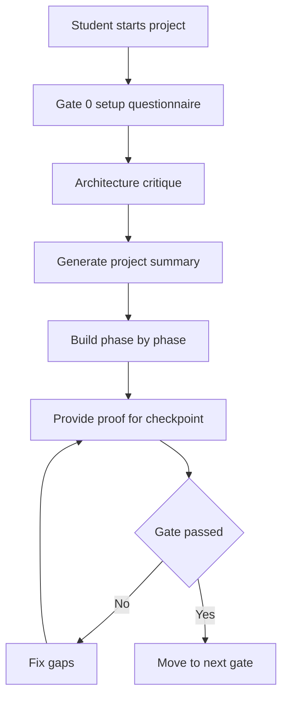

## Two line description

Likit is a lightweight spec kit that helps students build projects with AI as a mentor instead of a code writer.  
It uses gates, proof checkpoints, progress tracking, and strict habits to help users learn how to build by themselves.

## Links

[Article](https://medium.com/@priyanarora22/i-built-a-workflow-that-turns-ai-into-a-mentor-instead-of-a-code-generator-d971472dfe7c)

## Longer description

Likit is a lightweight workflow kit for students learning to build software projects. It is designed for AI coding tools such as Claude Code and Codex, but its purpose is not to let the AI write the project for the user. The purpose is to make the AI act like a senior engineer mentor.

Before implementation starts, Likit guides the user through a structured setup process. It asks about the project idea, the user’s skill level, the tech stack, the features, the architecture, and the constraints. It then critiques the answers, checks for gaps, and helps turn the idea into a clearer build plan.

The project is built around gates. A gate is a checkpoint that must pass before moving forward. Each gate has proof requirements such as command output, test results, working demos, or clear explanations. This prevents the user from skipping hard parts or saying something is done without evidence.

Gate 0 is the setup questionnaire. It creates the project summary and planning files from the user’s answers. Gates 1 through 17 are the build phases. Each phase focuses on a specific part of the project. The workflow also tracks progress so the user can return in a new session and continue without losing context.

Likit also enforces professional habits. These include building a walking skeleton first, using vertical slices, writing clear commits, testing core logic, keeping functions and names clean, avoiding unnecessary features, documenting important decisions, debugging with method, and ending sessions with small working progress.

The instruction set is intentionally small. It is designed to use only a small part of the model’s context window so the AI has more room left for the actual project, source files, conversation, and tool outputs. This was an important design goal because students often work with limited usage and cannot afford heavy instruction files that take over the context window.

## Workflow flow

## What I built

- Lightweight spec kit for Claude Code and Codex
- Gate-based project workflow
- Setup questionnaire for project planning
- Project summary generation flow
- Progress tracking between sessions
- Proof-based checkpoints
- Mentor-style critique rules
- Commands such as phase check, progress log, progress save, phase explain, and step explain
- Small instruction set designed to preserve context window space
- Student-focused workflow that blocks the AI from writing implementation code

## Why this project matters

Likit solves a real learning problem. AI can produce code quickly, but that can stop students from learning how to plan and build systems themselves. Likit keeps the AI useful without turning it into a shortcut. It forces the user to think, explain, test, and prove progress while still getting guidance.