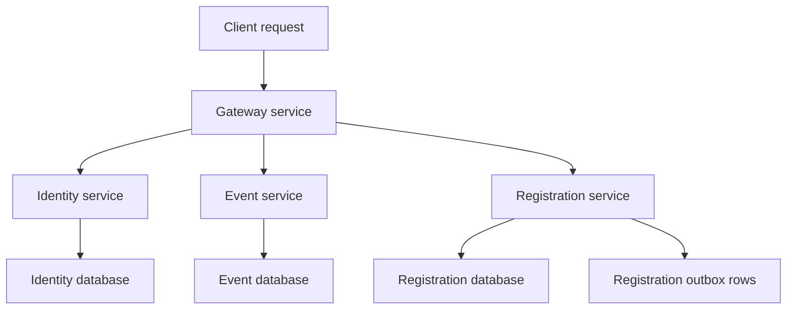

## Two line description

Event Management Platform is a Java microservice project for publishing events and reserving seats safely.  
It focuses on service boundaries, authentication, gateway routing, database migrations, and capacity-safe registration.

## Longer description

Event Management Platform is an in-progress learning portfolio project built around a small event-management system. The target system lets organizers create and publish events while attendees reserve seats without overselling the event capacity.

The project is structured as a microservice platform. The event service handles event records and event lifecycle actions. The identity service handles registration, login, the current user endpoint, password hashing, JWT creation, and authentication checks. The gateway service validates JWTs, applies role guards, proxies downstream requests, and forwards user headers. The registration service handles reservation APIs, capacity-safe reservations, cancellation, PostgreSQL storage, and outbox rows.

The current workspace includes work through Phase 10. It has event, identity, gateway, and registration services in place, with tests and database migrations across the services. The registration service uses Testcontainers for PostgreSQL-backed integration testing. Flyway is used to keep database changes versioned and repeatable.

The platform also includes draft OpenAPI and AsyncAPI contracts. These contracts help define service routes and planned event flows before all later behavior is built. Docker Compose starts shared local infrastructure such as PostgreSQL, RabbitMQ, and MailHog. RabbitMQ publishing, the React web client, Kubernetes manifests, and CI are planned for later gated phases.

This project is mainly about learning backend system design through a realistic service split. It shows how events, users, gateway routing, and registrations can be separated while still working together as one platform.

## Service flow

## What I built

- Spring Boot event service
- Spring Boot identity service
- Gateway service with JWT validation
- Registration service with reservation APIs
- Role guards for organizer and attendee flows
- Flyway migrations
- PostgreSQL storage
- Capacity-safe reservation logic
- Registration cancellation flow
- Outbox preparation
- Integration tests
- Testcontainers setup for registration testing
- Draft OpenAPI and AsyncAPI contracts
- Docker Compose local infrastructure

## Why this project matters

This project shows backend depth beyond a single API server. It covers service boundaries, authentication, gateway routing, database migrations, testing, and safe reservation logic. It also shows how to grow a system in phases instead of trying to build every service and deployment feature at once.